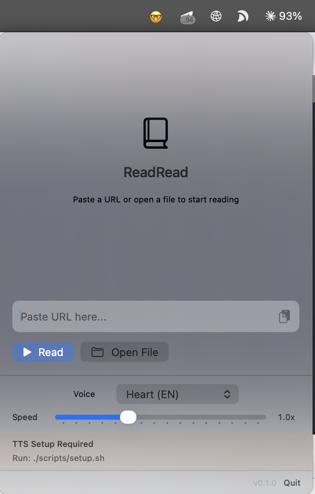

# ReadRead



A macOS menu bar app that reads web pages and local files aloud using offline text-to-speech.

Paste a URL, click Read, and listen. The app extracts the article text, detects the language, picks an appropriate voice, and starts reading — with a live text display that follows along.

## Features

- **Web pages** — paste any URL; content is extracted via [Defuddle](https://defuddle.md)
- **Local files** — open `.txt` and `.md` files directly
- **Offline TTS** — powered by [kokoro-onnx](https://github.com/thewh1teagle/kokoro-onnx), runs entirely on your machine
- **Multi-language** — Chinese, English, Japanese, French, Spanish with automatic language detection
- **43 voices** — 19 American English, 8 British English, 8 Chinese, 5 Japanese, and more
- **Live text** — scrolling text display highlights the current paragraph as it's read
- **Self-contained** — the `.app` bundle includes Python, the TTS model, and all dependencies

## Requirements

- macOS 14 (Sonoma) or later
- Apple Silicon or Intel Mac

## Build

```bash
# Build the self-contained .app (~490MB, includes Python + model)
./scripts/build-app.sh

# Open it
open build/ReadRead.app
```

The first build downloads a standalone Python runtime and the TTS model files. These are cached in `build/cache/` for subsequent builds.

## Development

```bash
# Set up a local Python environment + download models
./scripts/setup.sh

# Build and run from source
swift build
swift run ReadRead
```

## How it works

The app has two processes:

1. **Swift app** — menu bar UI built with SwiftUI + AppKit NSPanel
2. **Python subprocess** — local HTTP server wrapping kokoro-onnx for speech synthesis

When you paste a URL, the Swift app fetches the page content through the Defuddle API, strips it to plain text, detects the language, splits it into chunks, and sends each chunk to the Python TTS server. Audio is played back sequentially with the next chunk pre-fetched during playback for minimal gaps.

## Tech stack

- Swift 6 / SwiftUI / AppKit (zero external Swift dependencies)
- Python 3.12 (bundled standalone) + [kokoro-onnx](https://github.com/thewh1teagle/kokoro-onnx) + [misaki](https://github.com/hexgrad/misaki) (Chinese/Japanese G2P)
- Kokoro v1.0 fp16 ONNX model (82M parameters)

## License

MIT
